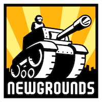
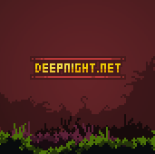

 

 
  
   
  <strong><a href="https://ruffle.rs">website</a> | <a href="http://ruffle-rs.s3-website-us-west-1.amazonaws.com/builds/web-demo/index.html?file=synj1.swf">demo</a> | <a href="http://ruffle-rs.s3-website-us-west-1.amazonaws.com/">nightly builds</a> | <a href="https://github.com/ruffle-rs/ruffle/wiki">wiki</a></strong>

# Ruffle

Ruffle is an Adobe Flash Player emulator written in the Rust programming language. Ruffle targets both the desktop and the web using WebAssembly.

## Project status

Ruffle is in the proof-of-concept stage and can currently run early Flash animations and games. Basic ActionScript 1.0/2.0 support is in place and improving; ActionScript 3.0 support is forthcoming. For more info, read the [project roadmap](https://github.com/ruffle-rs/ruffle/wiki/Roadmap).

## Nightly builds

[Nightly builds](http://ruffle-rs.s3-website-us-west-1.amazonaws.com/) of Ruffle are available for desktop and web platforms.

## Building from source

[Follow the official guide](https://www.rust-lang.org/tools/install) to install Rust for your platform.

### Desktop

* `cargo run --package=ruffle_desktop -- test.swf`

### Web

* Install [Node.js](https://nodejs.org/en/)
* Install [wasm-pack](https://rustwasm.github.io/wasm-pack/installer/)

#### Running the web demo

* `cd web/demo`
* `npm install`
* `npm run serve`
* Load indicated page in browser (usually http://localhost:8080)

#### Hosting on your own site

* `cd web/selfhosted`
* `npm install`
* `npm run build`
* Follow the wiki instructions for [using Ruffle on your own site](https://github.com/ruffle-rs/ruffle/wiki/Using-Ruffle#web)

### Scanner

If you have a collection of "real world" SWFs to test against, the scanner may be used to benchmark
ruffle's parsing capabilities. Provided with a folder and an output filename, it will attempt to read
all of the flash files and report on the success of such a task.

* `cargo run --package=ruffle_scanner -- folder/with/swfs/ results.csv`

## Structure

- `core` contains the core emulator and common code
- `desktop` contains the desktop client (uses `glium`)
- `web` contains the web client (uses `wasm-bindgen`)
- `scanner` contains a utility to bulk parse swf files

## Sponsors

You can support the development of Ruffle via [GitHub Sponsors](https://github.com/sponsors/Herschel). Your sponsorship will help to ensure the accessibility of Flash content for the future. Thank you!

Sincere thanks to the diamond level sponsors of Ruffle:

  
  
  
  
</a>

## License

Licensed under either of
 * Apache License, Version 2.0 ([LICENSE_APACHE](LICENSE_APACHE) or http://www.apache.org/licenses/LICENSE-2.0)
 * MIT license ([LICENSE_MIT](LICENSE_MIT) or http://opensource.org/licenses/MIT)
at your option.

### Contribution

Unless you explicitly state otherwise, any contribution intentionally submitted
for inclusion in the work by you shall be dual licensed as above, without any
additional terms or conditions.
